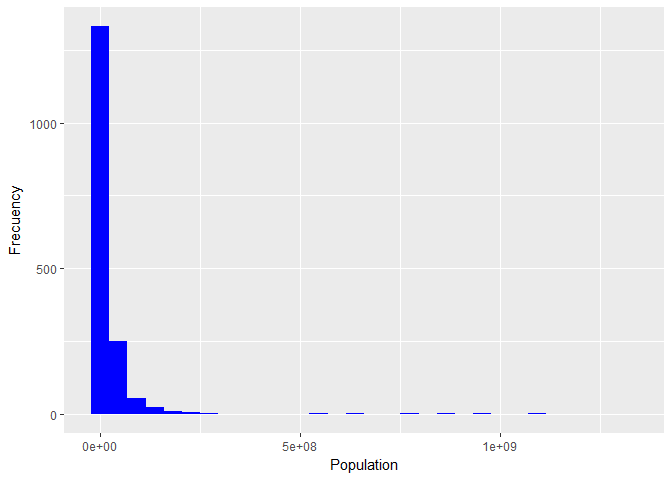
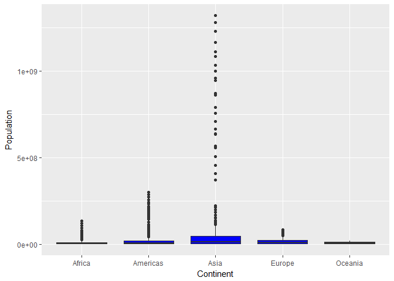
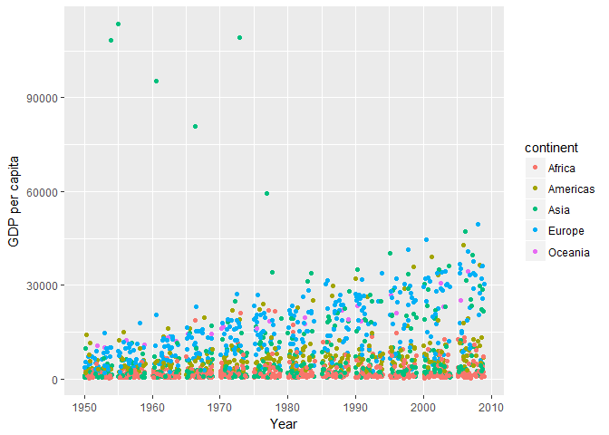
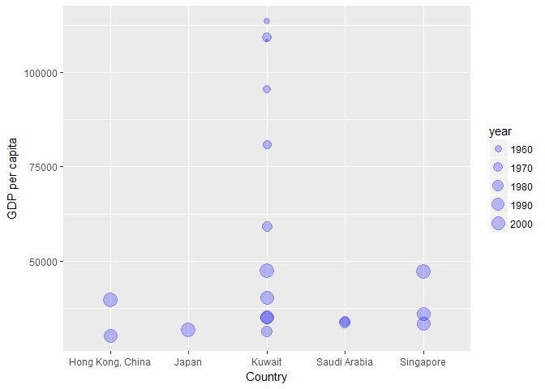

Exploring Gapminder exercise
================
Olivia Tabares-Mendoza

------------------------------------------------------------------------

**Explore the structure of the gapminder object**

The gapminder object has three classes: tibble diff(tbl\_df),tbl and data.frame, so it is essentially a tibble: a dataframe with better formatting and visualization than a regular dataframe (object created with as.data.frame function) [pacakge tibble reference](https://cran.r-project.org/web/packages/tibble/tibble.pdf)

``` r
library(tidyverse)
```

    ## Loading tidyverse: ggplot2
    ## Loading tidyverse: tibble
    ## Loading tidyverse: tidyr
    ## Loading tidyverse: readr
    ## Loading tidyverse: purrr
    ## Loading tidyverse: dplyr

    ## Conflicts with tidy packages ----------------------------------------------

    ## filter(): dplyr, stats
    ## lag():    dplyr, stats

``` r
library(gapminder)
str(gapminder)
```

    ## Classes 'tbl_df', 'tbl' and 'data.frame':    1704 obs. of  6 variables:
    ##  $ country  : Factor w/ 142 levels "Afghanistan",..: 1 1 1 1 1 1 1 1 1 1 ...
    ##  $ continent: Factor w/ 5 levels "Africa","Americas",..: 3 3 3 3 3 3 3 3 3 3 ...
    ##  $ year     : int  1952 1957 1962 1967 1972 1977 1982 1987 1992 1997 ...
    ##  $ lifeExp  : num  28.8 30.3 32 34 36.1 ...
    ##  $ pop      : int  8425333 9240934 10267083 11537966 13079460 14880372 12881816 13867957 16317921 22227415 ...
    ##  $ gdpPercap: num  779 821 853 836 740 ...

Gapminder has 1706 rows and 6 columns. The variables are factors; (country and continent), integer vectors(year and population), and numeric vectors(lifeExp and gdpPercap).
This information can be obtained easily through the str()function but also through the following functions

``` r
class(gapminder)
```

    ## [1] "tbl_df"     "tbl"        "data.frame"

``` r
nrow(gapminder)
```

    ## [1] 1704

``` r
ncol(gapminder)
```

    ## [1] 6

``` r
lapply(gapminder,class)
```

    ## $country
    ## [1] "factor"
    ## 
    ## $continent
    ## [1] "factor"
    ## 
    ## $year
    ## [1] "integer"
    ## 
    ## $lifeExp
    ## [1] "numeric"
    ## 
    ## $pop
    ## [1] "integer"
    ## 
    ## $gdpPercap
    ## [1] "numeric"

Information of lapply function was obtained from [stackoverflow](https://stackoverflow.com/questions/10661159/how-do-i-get-the-classes-of-all-columns-in-a-data-frame)

------------------------------------------------------------------------

**Explore individual variables and build plots with ggplot**

I explored all the variables with the summary function

``` r
summary(gapminder)
```

    ##         country        continent        year         lifeExp     
    ##  Afghanistan:  12   Africa  :624   Min.   :1952   Min.   :23.60  
    ##  Albania    :  12   Americas:300   1st Qu.:1966   1st Qu.:48.20  
    ##  Algeria    :  12   Asia    :396   Median :1980   Median :60.71  
    ##  Angola     :  12   Europe  :360   Mean   :1980   Mean   :59.47  
    ##  Argentina  :  12   Oceania : 24   3rd Qu.:1993   3rd Qu.:70.85  
    ##  Australia  :  12                  Max.   :2007   Max.   :82.60  
    ##  (Other)    :1632                                                
    ##       pop              gdpPercap       
    ##  Min.   :6.001e+04   Min.   :   241.2  
    ##  1st Qu.:2.794e+06   1st Qu.:  1202.1  
    ##  Median :7.024e+06   Median :  3531.8  
    ##  Mean   :2.960e+07   Mean   :  7215.3  
    ##  3rd Qu.:1.959e+07   3rd Qu.:  9325.5  
    ##  Max.   :1.319e+09   Max.   :113523.1  
    ## 

Through this function we can see the frecuency for each level of the continent and country factors, and descriptive statistics for all the numeric variables as well as the range and quartiles.

Exploring the data with histograms, we can see the population has a right skewed distribution with most of the countries having a population under 200,000,000 (2e+08) people through the years of study, we can see some outlayers as well

``` r
library(ggplot2)
p1<-ggplot(gapminder,aes(pop))+geom_histogram(fill="blue")+labs(x="Population", y="Frecuency")
p1
```

    ## `stat_bin()` using `bins = 30`. Pick better value with `binwidth`.



we can further explore how population is distributed in the different continents and look closely at the outlayers

``` r
p2<-ggplot(gapminder,aes(x=continent,y=pop))+geom_boxplot(fill="blue")+labs(x="Continent", y="Population")
p2
```



Asia has the most outlayers which probably correspond to data of China and India
We can also explore how the GDP per capita has behaved through the years across continents

``` r
p3<-ggplot(gapminder,aes(x=year,y=gdpPercap,color=continent))+geom_jitter()+labs(x="Year", y="GDP per capita")
p3
```



GDP per capita has a positive trend through the years, although for the Americas, Europe and Asia this growth is bigger than in Africa specially for 2000 and further. It is interesting to see how contients had a similar GDP in the fifties but since then they have shifted appart.
**Use of piping, filter and select functions**

Considering the data from the plot above, it comes into attention that Asia has some interesting outlayers, that I will explore by using the functions filter and select and then plot the results

``` r
filter(gapminder,continent=="Asia")%>%
  select(country,gdpPercap,year)%>%
  filter(gdpPercap>30000)%>%
  ggplot(aes(x=country, y=gdpPercap,size=year))+geom_point(alpha=0.25,color="blue")+labs(x="Country",y="GDP per capita")
```



It make sense that emerging world powers such as China and Japan had large GDPs in the 2000s as they secured new markets and invested in new technologies. The highest GDP per capita belongs to Kuwait in the 1960s, in that decade Kuwait became the largest oil exporter of the region attaining massive wealth and also attracting foreing investment. [History of Kuwait](https://en.wikipedia.org/wiki/History_of_Kuwait)
