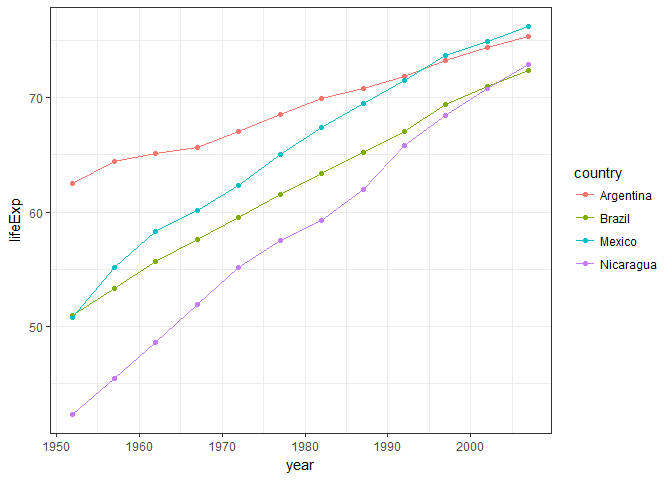

Homework 3: Use `dplyr` to manipulate and explore data (also use `ggplot2`)
================
Olivia Tabares-Mendoza

First I loaded the required libraries, the suppressPackage function comes in handy for creating a cleaner report

``` r
suppressPackageStartupMessages(library(tidyverse))
suppressPackageStartupMessages(library(gapminder))
suppressPackageStartupMessages(library(ggplot2))
```

**Task 1. Maximum and minimum GDP per continent**

In order to obtain this, I used the group\_by function to perform analyses considering continents as a group, and I piped this into summarise function that allows me perform specific functions(like min and max) to groups of data. To display a nice table I used the kable function in the knitr package
[kable function reference](https://www.rdocumentation.org/packages/knitr/versions/1.17/topics/kable).

``` r
GDP_percontinent<-gapminder %>%
group_by(continent)%>% 
summarise(minGDP = min(gdpPercap),maxGDP = max(gdpPercap))
knitr::kable(GDP_percontinent, digits=2, col.names=c("Continent", "Minimum GDP Per Capita","Maximum GDP Per Capita"))
```

| Continent |  Minimum GDP Per Capita|  Maximum GDP Per Capita|
|:----------|-----------------------:|-----------------------:|
| Africa    |                  241.17|                21951.21|
| Americas  |                 1201.64|                42951.65|
| Asia      |                  331.00|               113523.13|
| Europe    |                  973.53|                49357.19|
| Oceania   |                10039.60|                34435.37|

I used a bar plot for visualizing this infomation (although I believe that with the table is enough). To make the plot, it was necessary to use the melt function in the reshape2 package. This function allows you pile variables in a single column [melt reference](https://www.r-bloggers.com/melt/).
To modify the colors I consulted [plotly's geom\_bar post](https://plot.ly/ggplot2/geom_bar/)
and this [color guide](http://www.stat.columbia.edu/~tzheng/files/Rcolor.pdf)

``` r
suppressPackageStartupMessages(library(reshape2))
```

    ## Warning: package 'reshape2' was built under R version 3.4.2

``` r
gdpmelt<-melt(GDP_percontinent,id="continent")  
ggplot(gdpmelt,aes(continent,value,fill=variable))+theme_bw() +
  geom_bar(stat="identity", position="dodge")+
  scale_fill_manual(values=c("violetred2", "turquoise2"))+
  labs(x="Continent", y="GDP per capita")
```


------------------------------------------------------------------------

**Task 2. Spread of GDP by continent**
I obtanied spread metrics for each of the continents and then used a boxplot for a graphical representation

``` r
spread<-group_by(gapminder,continent) %>% 
  summarise(interq=IQR(gdpPercap),Median=median(gdpPercap))
knitr::kable(spread,digits=2,col.names =c("Continent","Interquartile range","Median"))
```

| Continent |  Interquartile range|    Median|
|:----------|--------------------:|---------:|
| Africa    |              1616.17|   1192.14|
| Americas  |              4402.43|   5465.51|
| Asia      |              7492.26|   2646.79|
| Europe    |             13248.30|  12081.75|
| Oceania   |              8072.26|  17983.30|

``` r
ggplot(gapminder,aes(continent,gdpPercap))+theme_classic()+geom_boxplot(fill="turquoise2")+labs(x="Continent", y="GDP per capita")
```


It is interesting to see how Oceania has an evenly distributed GDP with the highest median value and only one outlayer, thus having less fluctuations over the years, perhaps an indicator of a stable economy, although these data only come from two countries: Australia and New Zealand
**3. Life Expectancy over time**
For this task I created a time series for each continent using group\_by, select and summarise, using a mean per year as a summary variable

``` r
lifeexp<-gapminder %>% group_by(continent,year) %>% 
select(continent,lifeExp,year) %>% summarise(mean_lifeexp=mean(lifeExp))
  
knitr::kable(lifeexp,digits=2, col.names=c("Continent", "Year","Mean Life expectancy"))
```

| Continent |  Year|  Mean Life expectancy|
|:----------|-----:|---------------------:|
| Africa    |  1952|                 39.14|
| Africa    |  1957|                 41.27|
| Africa    |  1962|                 43.32|
| Africa    |  1967|                 45.33|
| Africa    |  1972|                 47.45|
| Africa    |  1977|                 49.58|
| Africa    |  1982|                 51.59|
| Africa    |  1987|                 53.34|
| Africa    |  1992|                 53.63|
| Africa    |  1997|                 53.60|
| Africa    |  2002|                 53.33|
| Africa    |  2007|                 54.81|
| Americas  |  1952|                 53.28|
| Americas  |  1957|                 55.96|
| Americas  |  1962|                 58.40|
| Americas  |  1967|                 60.41|
| Americas  |  1972|                 62.39|
| Americas  |  1977|                 64.39|
| Americas  |  1982|                 66.23|
| Americas  |  1987|                 68.09|
| Americas  |  1992|                 69.57|
| Americas  |  1997|                 71.15|
| Americas  |  2002|                 72.42|
| Americas  |  2007|                 73.61|
| Asia      |  1952|                 46.31|
| Asia      |  1957|                 49.32|
| Asia      |  1962|                 51.56|
| Asia      |  1967|                 54.66|
| Asia      |  1972|                 57.32|
| Asia      |  1977|                 59.61|
| Asia      |  1982|                 62.62|
| Asia      |  1987|                 64.85|
| Asia      |  1992|                 66.54|
| Asia      |  1997|                 68.02|
| Asia      |  2002|                 69.23|
| Asia      |  2007|                 70.73|
| Europe    |  1952|                 64.41|
| Europe    |  1957|                 66.70|
| Europe    |  1962|                 68.54|
| Europe    |  1967|                 69.74|
| Europe    |  1972|                 70.78|
| Europe    |  1977|                 71.94|
| Europe    |  1982|                 72.81|
| Europe    |  1987|                 73.64|
| Europe    |  1992|                 74.44|
| Europe    |  1997|                 75.51|
| Europe    |  2002|                 76.70|
| Europe    |  2007|                 77.65|
| Oceania   |  1952|                 69.25|
| Oceania   |  1957|                 70.30|
| Oceania   |  1962|                 71.09|
| Oceania   |  1967|                 71.31|
| Oceania   |  1972|                 71.91|
| Oceania   |  1977|                 72.85|
| Oceania   |  1982|                 74.29|
| Oceania   |  1987|                 75.32|
| Oceania   |  1992|                 76.94|
| Oceania   |  1997|                 78.19|
| Oceania   |  2002|                 79.74|
| Oceania   |  2007|                 80.72|

This can be better sinthezised and visualized in a plot

``` r
ggplot(lifeexp,aes(year,mean_lifeexp,color=continent))+geom_point()+geom_line()+theme_bw()+labs(x="Year", y="Mean Life Expectancy")
```


Not surprisingly, Europe and Oceania have the highest life expectancies through time, but again of only considering two countries with strong economies like Australia and New Zealand bias these results, it would be interesting to see how this changes when incorporating data from developing countries such as Indonesia and Papua-New Guinea.
**Task 4. Statistical comparison of life Expectancy in four countries in LatinAmerica**
To compare the life expectancy of Mexico, Nicaragua, Argentina and Brazil I did a preliminary exploratory table and a time series plot, using dplyr and ggplot

``` r
latinamerica<-filter(gapminder,country%in%c("Mexico","Nicaragua","Argentina","Brazil")) %>% 
  select(country,year,lifeExp)
latinamerica2<-latinamerica %>% 
  group_by(country) %>% 
  summarise(mean=mean(lifeExp))
knitr::kable(latinamerica2,digits=2)
```

| country   |   mean|
|:----------|------:|
| Argentina |  69.06|
| Brazil    |  62.24|
| Mexico    |  65.41|
| Nicaragua |  58.35|

``` r
ggplot(latinamerica,aes(year,lifeExp,color=country))+geom_point()+geom_line()+theme_bw()
```



It looks like these four countries might have differences in their mean life expectancies, to test this I performed an analysis of variance(ANOVA) using aov function and testing the assumptions of normality and homoscedasticity through shapiro and bartlett test [ANOVA assumptions](https://sites.ualberta.ca/~lkgray/uploads/7/3/6/2/7362679/slides_-_anova_assumptions.pdf)

``` r
anova1<-aov(lifeExp~country,data=latinamerica)
shapiro.test(anova1$residuals) 
```

    ## 
    ##  Shapiro-Wilk normality test
    ## 
    ## data:  anova1$residuals
    ## W = 0.98703, p-value = 0.8688

``` r
bartlett.test(lifeExp~country,data=latinamerica)
```

    ## 
    ##  Bartlett test of homogeneity of variances
    ## 
    ## data:  lifeExp by country
    ## Bartlett's K-squared = 7.5043, df = 3, p-value = 0.05745

``` r
summary(anova1)
```

    ##             Df Sum Sq Mean Sq F value Pr(>F)  
    ## country      3  748.8  249.60   4.245 0.0102 *
    ## Residuals   44 2586.9   58.79                 
    ## ---
    ## Signif. codes:  0 '***' 0.001 '**' 0.01 '*' 0.05 '.' 0.1 ' ' 1

``` r
TukeyHSD(anova1)
```

    ##   Tukey multiple comparisons of means
    ##     95% family-wise confidence level
    ## 
    ## Fit: aov(formula = lifeExp ~ country, data = latinamerica)
    ## 
    ## $country
    ##                           diff        lwr       upr     p adj
    ## Brazil-Argentina     -6.820917 -15.178816  1.536983 0.1450527
    ## Mexico-Argentina     -3.651583 -12.009483  4.706316 0.6508046
    ## Nicaragua-Argentina -10.711000 -19.068899 -2.353101 0.0071490
    ## Mexico-Brazil         3.169333  -5.188566 11.527233 0.7430308
    ## Nicaragua-Brazil     -3.890083 -12.247983  4.467816 0.6035348
    ## Nicaragua-Mexico     -7.059417 -15.417316  1.298483 0.1245133

As I don't reject the null hipothesis for both tests I can proceed the analysis of variance, that indcates significant differences between the countries (F=4.24,p&lt;0.05), the post-hoc test, Tukey HSD reveals that Argentina has a significantly higher mean life expectancy than Nicaragua, perhaps due to Nicaragua's Sandinist Revolution and consistent gang problems
