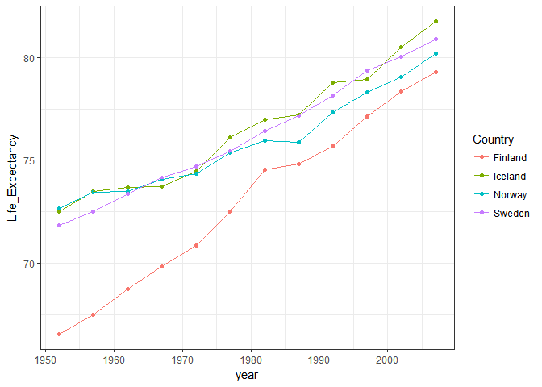
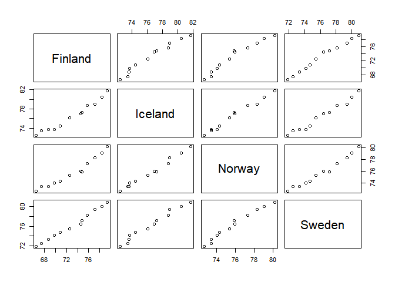

Homework 04: Tidy data and joins
================

First I must load the required libraries

``` r
suppressPackageStartupMessages(library(tidyverse))
```

    ## Warning: package 'tidyverse' was built under R version 3.4.3

    ## Warning: package 'tidyr' was built under R version 3.4.3

    ## Warning: package 'purrr' was built under R version 3.4.3

    ## Warning: package 'dplyr' was built under R version 3.4.3

    ## Warning: package 'forcats' was built under R version 3.4.2

``` r
suppressPackageStartupMessages(library(gapminder))
```

    ## Warning: package 'gapminder' was built under R version 3.4.3

### **General data reshaping task**

I chose to do Activity \#2:
*Make a tibble with one row per year and columns for life expectancy for two or more countries.Use knitr::kable() to make this table look pretty in your rendered homework. Take advantage of this new data shape to scatterplot life expectancy for one country against that of another*

I made a "wide" dataframe for the countries in Scandinavia using the spread function.

``` r
viking_countries<-gapminder %>% 
  select(year,country,lifeExp) %>% 
  filter(country%in% c("Finland","Iceland","Norway","Sweden")) %>% 
  spread(country,lifeExp)
knitr::kable(viking_countries,digits = 2,
       col.names = c("Year","Life Expectancy in Finland",
        "Life Expectancy in Iceland","Life Expectancy in Norway",
        "Life Expectancy in Sweden"),align = "c")
```

| Year | Life Expectancy in Finland | Life Expectancy in Iceland | Life Expectancy in Norway | Life Expectancy in Sweden |
|:----:|:--------------------------:|:--------------------------:|:-------------------------:|:-------------------------:|
| 1952 |            66.55           |            72.49           |           72.67           |           71.86           |
| 1957 |            67.49           |            73.47           |           73.44           |           72.49           |
| 1962 |            68.75           |            73.68           |           73.47           |           73.37           |
| 1967 |            69.83           |            73.73           |           74.08           |           74.16           |
| 1972 |            70.87           |            74.46           |           74.34           |           74.72           |
| 1977 |            72.52           |            76.11           |           75.37           |           75.44           |
| 1982 |            74.55           |            76.99           |           75.97           |           76.42           |
| 1987 |            74.83           |            77.23           |           75.89           |           77.19           |
| 1992 |            75.70           |            78.77           |           77.32           |           78.16           |
| 1997 |            77.13           |            78.95           |           78.32           |           79.39           |
| 2002 |            78.37           |            80.50           |           79.05           |           80.04           |
| 2007 |            79.31           |            81.76           |           80.20           |           80.88           |

This wide dataframe is easier to visualize if you want to make comparisons between the countries. In this case the countries behave very similar to one another from the 1980's to 2007. Before that, Finland had a lower life expectancy than the other countries in the Scandinavian Peninsula. We can see this in a time series graph, that would be easier to do in the "long format" that we can easily obtain with the gather() function

``` r
longframe<-viking_countries %>% 
  gather(key="Country",value="Life_Expectancy",Finland:Sweden)%>%
  ggplot(aes(year,Life_Expectancy,color=Country))+
  geom_point()+
  geom_line()+
  theme_bw()
longframe
```

 As suggested by the prompt, I plotted the life expectancies of the countries against each other using the pairs function (I couldn't find a way to do this in ggplot)

``` r
pairs(~Finland+Iceland+Norway+Sweden,data=viking_countries)
```



### **Join task**

**1. Create a new dataframe that complements a part of gapminder**
First I selected a part of gapminder to work with

``` r
scandinavia<-gapminder %>% 
  filter(country%in% c("Finland","Iceland","Norway","Sweden"),year>2000)

knitr::kable(scandinavia)
```

| country | continent |  year|  lifeExp|      pop|  gdpPercap|
|:--------|:----------|-----:|--------:|--------:|----------:|
| Finland | Europe    |  2002|   78.370|  5193039|   28204.59|
| Finland | Europe    |  2007|   79.313|  5238460|   33207.08|
| Iceland | Europe    |  2002|   80.500|   288030|   31163.20|
| Iceland | Europe    |  2007|   81.757|   301931|   36180.79|
| Norway  | Europe    |  2002|   79.050|  4535591|   44683.98|
| Norway  | Europe    |  2007|   80.196|  4627926|   49357.19|
| Sweden  | Europe    |  2002|   80.040|  8954175|   29341.63|
| Sweden  | Europe    |  2007|   80.884|  9031088|   33859.75|

Then I created the complementary data frame

``` r
complement<-data.frame(country=c("Finland","Denmark","Norway","Sweden"),
                          language=c("Suomi","Dansk","Norsk","Svensk"),
                                     Uses_Euro=c("YES","NO","NO","NO"))
knitr::kable(complement)
```

| country | language | Uses\_Euro |
|:--------|:---------|:-----------|
| Finland | Suomi    | YES        |
| Denmark | Dansk    | NO         |
| Norway  | Norsk    | NO         |
| Sweden  | Svensk   | NO         |

**2.Explore joins**
Using the data frames that I created I explored all the joins, an explanation of how they work can be found in this useful cheatsheet 

This is part of the excellent [Data Wrangling in R cheatsheet](https://www.rstudio.com/wp-content/uploads/2015/02/data-wrangling-cheatsheet.pdf)

``` r
knitr::kable(left_join(scandinavia,complement))
```

    ## Joining, by = "country"

    ## Warning: Column `country` joining factors with different levels, coercing
    ## to character vector

| country | continent |  year|  lifeExp|      pop|  gdpPercap| language | Uses\_Euro |
|:--------|:----------|-----:|--------:|--------:|----------:|:---------|:-----------|
| Finland | Europe    |  2002|   78.370|  5193039|   28204.59| Suomi    | YES        |
| Finland | Europe    |  2007|   79.313|  5238460|   33207.08| Suomi    | YES        |
| Iceland | Europe    |  2002|   80.500|   288030|   31163.20| NA       | NA         |
| Iceland | Europe    |  2007|   81.757|   301931|   36180.79| NA       | NA         |
| Norway  | Europe    |  2002|   79.050|  4535591|   44683.98| Norsk    | NO         |
| Norway  | Europe    |  2007|   80.196|  4627926|   49357.19| Norsk    | NO         |
| Sweden  | Europe    |  2002|   80.040|  8954175|   29341.63| Svensk   | NO         |
| Sweden  | Europe    |  2007|   80.884|  9031088|   33859.75| Svensk   | NO         |

``` r
knitr::kable(right_join(scandinavia,complement))
```

    ## Joining, by = "country"

    ## Warning: Column `country` joining factors with different levels, coercing
    ## to character vector

| country | continent |  year|  lifeExp|      pop|  gdpPercap| language | Uses\_Euro |
|:--------|:----------|-----:|--------:|--------:|----------:|:---------|:-----------|
| Finland | Europe    |  2002|   78.370|  5193039|   28204.59| Suomi    | YES        |
| Finland | Europe    |  2007|   79.313|  5238460|   33207.08| Suomi    | YES        |
| Denmark | NA        |    NA|       NA|       NA|         NA| Dansk    | NO         |
| Norway  | Europe    |  2002|   79.050|  4535591|   44683.98| Norsk    | NO         |
| Norway  | Europe    |  2007|   80.196|  4627926|   49357.19| Norsk    | NO         |
| Sweden  | Europe    |  2002|   80.040|  8954175|   29341.63| Svensk   | NO         |
| Sweden  | Europe    |  2007|   80.884|  9031088|   33859.75| Svensk   | NO         |

``` r
knitr::kable(full_join(scandinavia,complement))
```

    ## Joining, by = "country"

    ## Warning: Column `country` joining factors with different levels, coercing
    ## to character vector

| country | continent |  year|  lifeExp|      pop|  gdpPercap| language | Uses\_Euro |
|:--------|:----------|-----:|--------:|--------:|----------:|:---------|:-----------|
| Finland | Europe    |  2002|   78.370|  5193039|   28204.59| Suomi    | YES        |
| Finland | Europe    |  2007|   79.313|  5238460|   33207.08| Suomi    | YES        |
| Iceland | Europe    |  2002|   80.500|   288030|   31163.20| NA       | NA         |
| Iceland | Europe    |  2007|   81.757|   301931|   36180.79| NA       | NA         |
| Norway  | Europe    |  2002|   79.050|  4535591|   44683.98| Norsk    | NO         |
| Norway  | Europe    |  2007|   80.196|  4627926|   49357.19| Norsk    | NO         |
| Sweden  | Europe    |  2002|   80.040|  8954175|   29341.63| Svensk   | NO         |
| Sweden  | Europe    |  2007|   80.884|  9031088|   33859.75| Svensk   | NO         |
| Denmark | NA        |    NA|       NA|       NA|         NA| Dansk    | NO         |

``` r
knitr::kable(inner_join(scandinavia,complement))
```

    ## Joining, by = "country"

    ## Warning: Column `country` joining factors with different levels, coercing
    ## to character vector

| country | continent |  year|  lifeExp|      pop|  gdpPercap| language | Uses\_Euro |
|:--------|:----------|-----:|--------:|--------:|----------:|:---------|:-----------|
| Finland | Europe    |  2002|   78.370|  5193039|   28204.59| Suomi    | YES        |
| Finland | Europe    |  2007|   79.313|  5238460|   33207.08| Suomi    | YES        |
| Norway  | Europe    |  2002|   79.050|  4535591|   44683.98| Norsk    | NO         |
| Norway  | Europe    |  2007|   80.196|  4627926|   49357.19| Norsk    | NO         |
| Sweden  | Europe    |  2002|   80.040|  8954175|   29341.63| Svensk   | NO         |
| Sweden  | Europe    |  2007|   80.884|  9031088|   33859.75| Svensk   | NO         |

``` r
knitr::kable(semi_join(scandinavia,complement))
```

    ## Joining, by = "country"

    ## Warning: Column `country` joining factors with different levels, coercing
    ## to character vector

| country | continent |  year|  lifeExp|      pop|  gdpPercap|
|:--------|:----------|-----:|--------:|--------:|----------:|
| Finland | Europe    |  2002|   78.370|  5193039|   28204.59|
| Finland | Europe    |  2007|   79.313|  5238460|   33207.08|
| Norway  | Europe    |  2002|   79.050|  4535591|   44683.98|
| Norway  | Europe    |  2007|   80.196|  4627926|   49357.19|
| Sweden  | Europe    |  2002|   80.040|  8954175|   29341.63|
| Sweden  | Europe    |  2007|   80.884|  9031088|   33859.75|

``` r
knitr::kable(anti_join(scandinavia,complement))
```

    ## Joining, by = "country"

    ## Warning: Column `country` joining factors with different levels, coercing
    ## to character vector

| country | continent |  year|  lifeExp|     pop|  gdpPercap|
|:--------|:----------|-----:|--------:|-------:|----------:|
| Iceland | Europe    |  2002|   80.500|  288030|   31163.20|
| Iceland | Europe    |  2007|   81.757|  301931|   36180.79|
