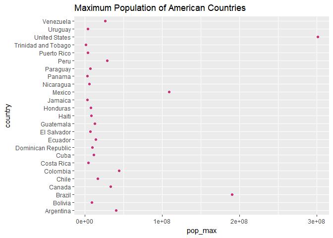
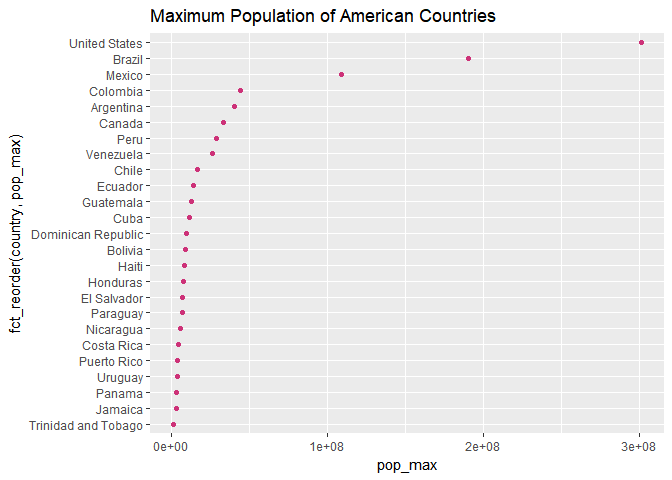

Homework 05-Factor and figure management; Repo hygiene
================
Olivia Tabares-Mendoza

**Load libraries used**

``` r
suppressPackageStartupMessages(library(tidyverse))
suppressPackageStartupMessages(library(gapminder))
suppressPackageStartupMessages(library(knitr))
suppressPackageStartupMessages(library(forcats))
```

    ## Warning: package 'forcats' was built under R version 3.4.2

``` r
suppressPackageStartupMessages(library(singer)) 
```

**Factor management**
---------------------

Factors are a data type in R for categorical variables, every value that a factor can take is called a level (eg. if the factor is color the levels would be red, blue, magenta, green etc.). Not to confound with statistical factors, those are the explanatory or independent variables.

**Task 1-drop Oceania**

We start by examining the data frame and the factors

``` r
glimpse(gapminder)
```

    ## Observations: 1,704
    ## Variables: 6
    ## $ country   <fctr> Afghanistan, Afghanistan, Afghanistan, Afghanistan,...
    ## $ continent <fctr> Asia, Asia, Asia, Asia, Asia, Asia, Asia, Asia, Asi...
    ## $ year      <int> 1952, 1957, 1962, 1967, 1972, 1977, 1982, 1987, 1992...
    ## $ lifeExp   <dbl> 28.801, 30.332, 31.997, 34.020, 36.088, 38.438, 39.8...
    ## $ pop       <int> 8425333, 9240934, 10267083, 11537966, 13079460, 1488...
    ## $ gdpPercap <dbl> 779.4453, 820.8530, 853.1007, 836.1971, 739.9811, 78...

``` r
fct_count(gapminder$continent)
```

    ## # A tibble: 5 x 2
    ##          f     n
    ##     <fctr> <int>
    ## 1   Africa   624
    ## 2 Americas   300
    ## 3     Asia   396
    ## 4   Europe   360
    ## 5  Oceania    24

Then we drop Oceania by first using filter with the logical operator ! (not equal to).

When we compare the number of observations of original gapminder (1704) vs the number of the subsetted gapminder (1680) we can see oceania has been filtered but as we haven't applied a function that gets rid of the unused factors, thus Oceania still appears

``` r
subs_gapminder<-gapminder %>%
  filter(continent!="Oceania")
glimpse(subs_gapminder)
```

    ## Observations: 1,680
    ## Variables: 6
    ## $ country   <fctr> Afghanistan, Afghanistan, Afghanistan, Afghanistan,...
    ## $ continent <fctr> Asia, Asia, Asia, Asia, Asia, Asia, Asia, Asia, Asi...
    ## $ year      <int> 1952, 1957, 1962, 1967, 1972, 1977, 1982, 1987, 1992...
    ## $ lifeExp   <dbl> 28.801, 30.332, 31.997, 34.020, 36.088, 38.438, 39.8...
    ## $ pop       <int> 8425333, 9240934, 10267083, 11537966, 13079460, 1488...
    ## $ gdpPercap <dbl> 779.4453, 820.8530, 853.1007, 836.1971, 739.9811, 78...

``` r
fct_count(subs_gapminder$continent)
```

    ## # A tibble: 5 x 2
    ##          f     n
    ##     <fctr> <int>
    ## 1   Africa   624
    ## 2 Americas   300
    ## 3     Asia   396
    ## 4   Europe   360
    ## 5  Oceania     0

We can use the function drop factors to get rid of the unused factors, now there are four factors and we have succesfully dropped Oceania

``` r
  subs_gapminder$continent %>% droplevels() %>% 
fct_count
```

    ## # A tibble: 4 x 2
    ##          f     n
    ##     <fctr> <int>
    ## 1   Africa   624
    ## 2 Americas   300
    ## 3     Asia   396
    ## 4   Europe   360

**Task 2**
**Reorder the levels of country or continent. Use the forcats package to change the order of the factor levels, based on a principled summary of one of the quantitative variables. Consider experimenting with a summary statistic beyond the most basic choice of the median**

Without reordering, the factor country is just ordered in an alphabetical way

``` r
head(levels(gapminder$country))
```

    ## [1] "Afghanistan" "Albania"     "Algeria"     "Angola"      "Argentina"  
    ## [6] "Australia"

When we reorder, in this case using the maximum population as the principle summary for ordering we obtain the countries ordered in a descending order, this allow us to quickly visualize which countries are most populated.

``` r
fct_reorder(f=gapminder$country,
            x=gapminder$pop,
            fun=max,.desc=T) %>% 
  levels() %>% head()
```

    ## [1] "China"         "India"         "United States" "Indonesia"    
    ## [5] "Brazil"        "Pakistan"

**Task 3**
**Explore the effects of arrange(). Does merely arranging the data have any effect on, say, a figure?**

To do this I am ordering the database also using the maximum population but subsetting gapminder to consider only countries in America. First let's look at the data without arrange and plot them

``` r
pop_gapminder_america <- gapminder %>%
  filter(continent=="Americas") %>% 
  group_by(country) %>%
  summarise(pop_max= max(pop))
 
kable(pop_gapminder_america,
      digits=2,
      col.names=c("Country","Maximum Population"),
      align="c")
```

|       Country       | Maximum Population |
|:-------------------:|:------------------:|
|      Argentina      |      40301927      |
|       Bolivia       |       9119152      |
|        Brazil       |      190010647     |
|        Canada       |      33390141      |
|        Chile        |      16284741      |
|       Colombia      |      44227550      |
|      Costa Rica     |       4133884      |
|         Cuba        |      11416987      |
|  Dominican Republic |       9319622      |
|       Ecuador       |      13755680      |
|     El Salvador     |       6939688      |
|      Guatemala      |      12572928      |
|        Haiti        |       8502814      |
|       Honduras      |       7483763      |
|       Jamaica       |       2780132      |
|        Mexico       |      108700891     |
|      Nicaragua      |       5675356      |
|        Panama       |       3242173      |
|       Paraguay      |       6667147      |
|         Peru        |      28674757      |
|     Puerto Rico     |       3942491      |
| Trinidad and Tobago |       1191336      |
|    United States    |      301139947     |
|       Uruguay       |       3447496      |
|      Venezuela      |      26084662      |

``` r
ggplot(pop_gapminder_america,aes(x=pop_max, y=country))+
  geom_point(color="violetred3")+
  ggtitle("Maximum Population of American Countries" )
```

 Again the data is ordered alphabetically which isn't very useful

Now if we arrange in a descending order we can get the most populated nations in a table

``` r
pop_gapminder_america2 <- gapminder %>%
  filter(continent=="Americas") %>% 
  group_by(country) %>%
  summarise(pop_max= max(pop)) %>% 
  arrange(desc(pop_max))
  
kable(pop_gapminder_america2,
      digits=2,
      col.names=c("Country","Maximum Population"),
      align="c")
```

|       Country       | Maximum Population |
|:-------------------:|:------------------:|
|    United States    |      301139947     |
|        Brazil       |      190010647     |
|        Mexico       |      108700891     |
|       Colombia      |      44227550      |
|      Argentina      |      40301927      |
|        Canada       |      33390141      |
|         Peru        |      28674757      |
|      Venezuela      |      26084662      |
|        Chile        |      16284741      |
|       Ecuador       |      13755680      |
|      Guatemala      |      12572928      |
|         Cuba        |      11416987      |
|  Dominican Republic |       9319622      |
|       Bolivia       |       9119152      |
|        Haiti        |       8502814      |
|       Honduras      |       7483763      |
|     El Salvador     |       6939688      |
|       Paraguay      |       6667147      |
|      Nicaragua      |       5675356      |
|      Costa Rica     |       4133884      |
|     Puerto Rico     |       3942491      |
|       Uruguay       |       3447496      |
|        Panama       |       3242173      |
|       Jamaica       |       2780132      |
| Trinidad and Tobago |       1191336      |

The table is adequate but if we plot this arranged dataframe we still get the countries ordered alphabetically in the plot. Thus arrange alone is not sufficient to render good plots

``` r
ggplot(pop_gapminder_america2,aes(x=pop_max, y=country))+
  geom_point(color="violetred3")+
  ggtitle("Maximum Population of American Countries" )
```


\*\* Task 4. Explore the effects of reordering a factor and factor reordering coupled with arrange(). Especially, what effect does this have on a figure?\*\*

factor reordering Using the countries in America I reordered the factor country using the maximum population size

``` r
pop_gapminder_america <- gapminder %>%
  filter(continent=="Americas") %>% 
  group_by(country) %>%
  summarise(pop_max= max(pop))
ggplot(pop_gapminder_america,(aes(x=pop_max,
                                 y=fct_reorder(country,pop_max))))+
  geom_point(color="violetred3")+
  ggtitle("Maximum Population of American Countries" )
```

 Now if we use arrange and fct\_reorder together we can get an ordered table and figure

``` r
pop_gapminder_america <- gapminder %>%
  filter(continent=="Americas") %>% 
  group_by(country) %>%
  summarise(pop_max= max(pop)) %>% 
arrange(desc(pop_max))

kable(pop_gapminder_america,
      digits=2,
      col.names=c("Country","Maximum Population"),
      align="c")
```

|       Country       | Maximum Population |
|:-------------------:|:------------------:|
|    United States    |      301139947     |
|        Brazil       |      190010647     |
|        Mexico       |      108700891     |
|       Colombia      |      44227550      |
|      Argentina      |      40301927      |
|        Canada       |      33390141      |
|         Peru        |      28674757      |
|      Venezuela      |      26084662      |
|        Chile        |      16284741      |
|       Ecuador       |      13755680      |
|      Guatemala      |      12572928      |
|         Cuba        |      11416987      |
|  Dominican Republic |       9319622      |
|       Bolivia       |       9119152      |
|        Haiti        |       8502814      |
|       Honduras      |       7483763      |
|     El Salvador     |       6939688      |
|       Paraguay      |       6667147      |
|      Nicaragua      |       5675356      |
|      Costa Rica     |       4133884      |
|     Puerto Rico     |       3942491      |
|       Uruguay       |       3447496      |
|        Panama       |       3242173      |
|       Jamaica       |       2780132      |
| Trinidad and Tobago |       1191336      |

``` r
ggplot(pop_gapminder_america,(aes(x=pop_max,
                                 y=fct_reorder(country,pop_max))))+
  geom_point(color="violetred3")+
  ggtitle("Maximum Population of American Countries" )
```

 \`\`\`
